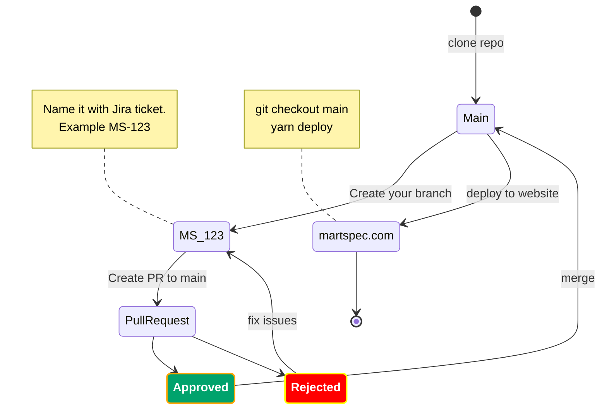

## About
[Martspec](martspec.com) is focused on promoting a healthy lifestyle. Our objective is to assist users in leading a healthier lifestyle by considering their vitamin and mineral intake, psychological well-being, and body characteristics.


## Install
```
nvm current                         # Check current *node* version
nvm use 16.16.0                     # Use *node* version 16

git clone <repo link>               # Clone repo to your local computer
yarn install                        # Install all dependencies
yarn svr                            # Run website locally

yarn outdated                       # See what packages can be updated
yarn upgrade-interactive --latest   # Interactively update to the latest versions
```

## Workflow



## Images WebP

We use **webp** format for non SVG images on the site. When we get new image from designer do this:
1. Copy PNG image to */src/img/org* folder
2. Run script */src/img/img.sh*

This will create .webp images in /src/img folder whose max size would be 512px. In order to run scrip you need to install the following aps:
- cwebp
- pngcrush
- sips


## 🔗 Links


[](https://martspec.com)
[]([https://linkedin.com/in/protyagov](https://www.linkedin.com/company/28132561))
[](https://dev.to/protyagov)
[](https://medium.com/@martspec)
[](https://www.instagram.com/martspec_com/)
