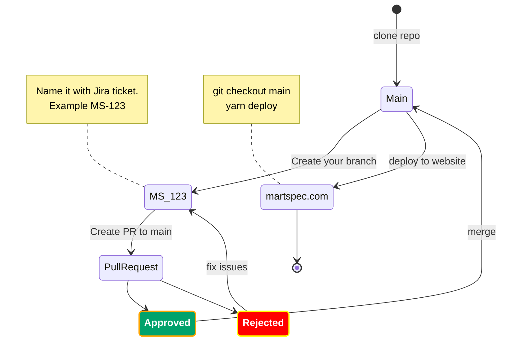

## About

[Martspec](https://martspec.com/) is focused on promoting a healthy lifestyle. Our objective is to assist users in leading a healthier lifestyle by considering their vitamin and mineral intake, psychological well-being, and body characteristics.


## Install

```
nvm current                         # Check current *node* version
nvm use 16.16.0                     # Use *node* version 16

git clone <repo link>               # Clone repo to your local computer
yarn install                        # Install all dependencies
yarn svr                            # Run website locally

yarn outdated                       # See what packages can be updated
yarn upgrade-interactive --latest   # Interactively update to the latest versions
```

## Workflow



## Ladle stories

We use [ladle](https://ladle.dev/) this tool to create and consume components and example components (stories). <br/>
Go to [martspec.com/development](https://martspec.com/development) to see the components we have developed.
<br />

commands:

```
yarn ladle serve                    # Start dev server locally
```

## Images WebP

We use **webp** format for non SVG images on the site. When we get new images from designer do this:

1. Copy PNG images to an empty _/src/img/new_ folder.

2. Run script _/src/img/img.sh_:
    - open the Git Bash terminal
    - run `./src/img/img.sh`
3. Delete images from the _/src/img/new_ folder after checking the resulting images.

This will create .webp images in _/src/img_ folder whose max size would be 512px.

#### Script settings 🛠️:

-   `DIR_INPUT` - the source directory with the images to convert (relative to the script folder). Default value `new` for _/src/img/new_ folder.

-   `DIR_OUT` - the output directory with the resulting images (relative to the script folder). Default empty value for _/src/img_ folder.

-   `MAX_SIZE` - maximum size in px for the image height and width. Default value: `512`.

#### In order to run the script you need to install the following aps:

-   [cwebp](https://developers.google.com/speed/webp/download) - WebP encoder tool to compress an image file to a WebP file

-   [pngcrush](https://pmt.sourceforge.io/pngcrush/) - an optimizer for PNG files

-   for non-macOS operating systems:

    -   [magick](https://imagemagick.org/script/download.php) - command line tool from ImageMagick
        > on macOS the script uses [sips](https://ss64.com/mac/sips.html) - the macOS command line tool
